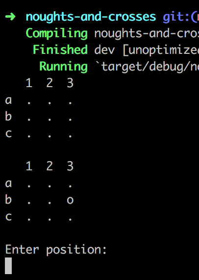

# Noughts and crosses game

Command-line noughts and crosses game, written in Rust. Play by entering a board position (a1 - c3) and win by getting three in a row (horizontal, vertical or diagonal).

## Usage
- You will need [Rust and cargo installed](https://www.rust-lang.org/en-US/) (tested with v1.16)
- `cargo run`

## Overview
Based on Redux architecture - state is stored in the store (`store.rs`), and is immutable. Any changes are requested via a reducer method which returns a new version of the state in the store. For further details see Redux and [this great Rust tutorial](http://fredrik.anderzon.se/2016/05/10/rust-for-node-developers-part-1-introduction/).
